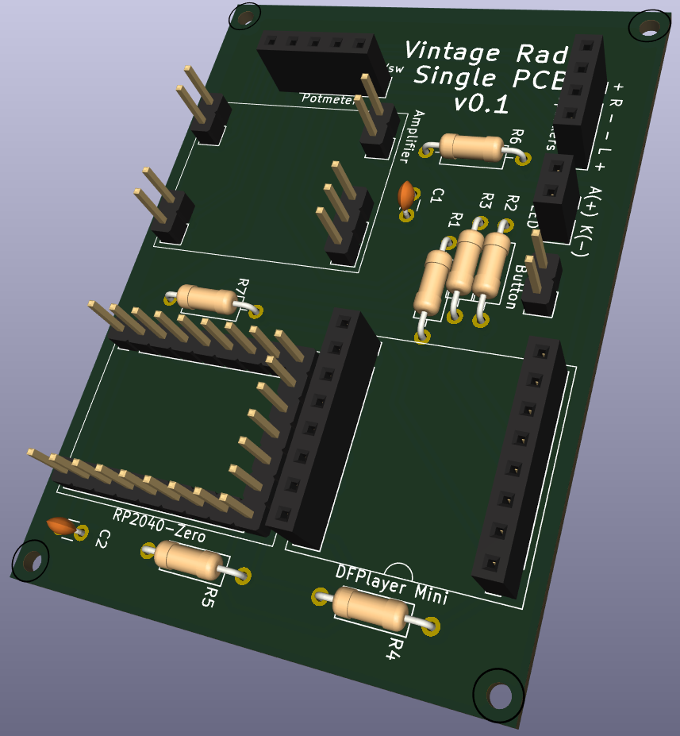
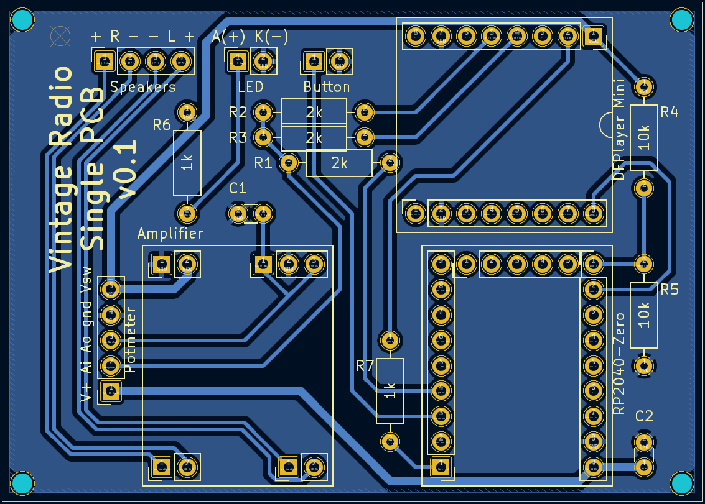

# Vintage Radio &ndash; Single PCB

This is a single PCB solution to [Zion Brock](https://www.zionbrock.com/radio)'s Vintage Radio project.

---

## 📌 Overview

This repository contains the design files, created using KiCad.
The project includes schematics, PCB layout, and manufacturing outputs.

---

## 🛠️ Design Tools

- EDA Software: KiCad 8.0
- Board Type: **Single** layer whatever-suits-your-needs-material
- Dimensions: 4.85&times;7cm

---

## 📁 Repository Structure

    .
    ├── fabrication/            # Gerbers, drill files, bill-of-materials
    ├── images/                 # Images
    ├── VintageRadio.kicad_pcb  # KiCad PCB layout
    ├── VintageRadio.kicad_pro  # KiCad project
    ├── VintageRadio.kicad_sch  # KiCad schematic
    ├── CHANGELOG.txt
    ├── LICENSE
    └── README.md

---

## 🧩 Components

- RP2040-Zero
- DFPlayer Mini
- Amplifier
- Some resistors, caps, and headers

See the BOM in the [fabrication/]() folder for full details.

---

## 🏭 Fabrication Notes

- Trace widths: 0.4mm
- Drill sizes: 0.8mm (components), 1mm (headers), 2mm (mounting holes)
- Assembly: Hand assembly, check the [YouTube](https://www.youtube.com/watch?v=w2aT9UKJ8m4) video as well.

---

## 📷 Images

Schematic: 
PCB: 

---

## 📄 License

This project is under CC0-1.0 licence, see the [LICENSE]() file for details.